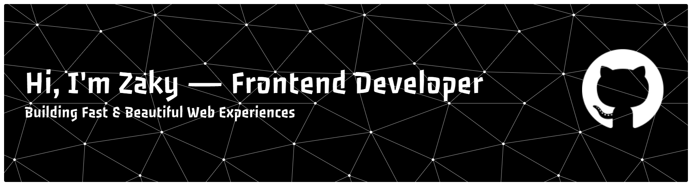

  

<h2 align="left">🙋‍♂️ About me</h2>

###

Frontend Developer focused on building scalable and high-performance web applications using Next.js and React.  I enjoy solving real-world problems and creating user-friendly interfaces. Currently preparing for remote opportunities in global tech companies.

###

<h2 align="left">🌌 TECH STACK</h2>

###

  
  
  
  
  
  
  
  
  
  
  
  
  
  
  
  
  
  
  
  
  
  
  
  
  
  
  

###

<h2 align="left">💻 FEATURED PROJECTS</h2>

###

Project Name  Short description (apa yang kamu buat)  Key Value: - Apa manfaatnya - Kenapa ini berguna di dunia nyata  Tech: Next.js, Tailwind, API  Live Demo | Source Code

###

<h2 align="left">💼 WHAT YOU’RE DOING NOW</h2>

###

- Building fullstack apps with Next.js - Learning advanced frontend architecture - Improving performance and scalability

###

<h2 align="left">📬 CONTACT (PROFESSIONAL)</h2>

###

Email: your@email.com   Instagram: link LinkedIn: link   Personal Portfolio Website: link

###

<picture>
  <source media="(prefers-color-scheme: dark)" srcset="https://raw.githubusercontent.com/zakyalfarizi/output/pacman-contribution-graph-dark.svg">
  <source media="(prefers-color-scheme: light)" srcset="https://raw.githubusercontent.com/zakyalfarizi/output/pacman-contribution-graph.svg">
  
</picture>

###

<h2 align="left">📈GitHub Stats</h2>

  

